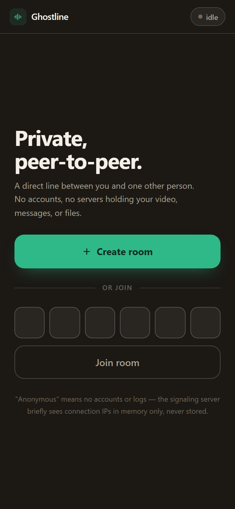
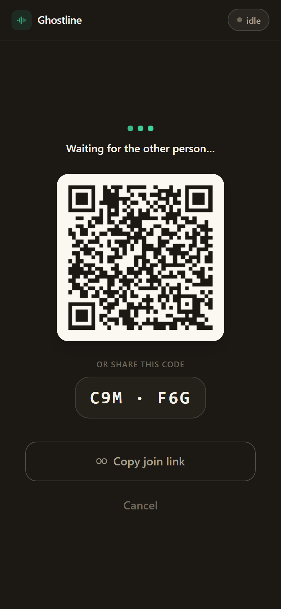
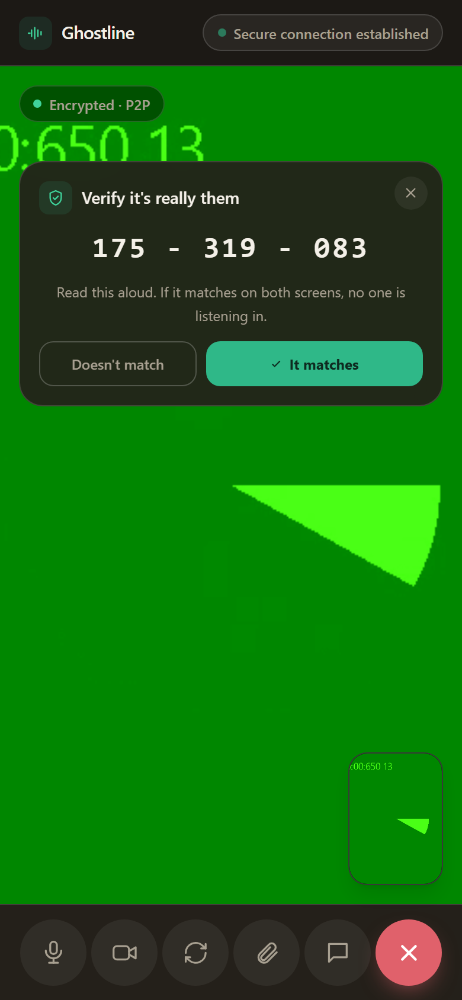
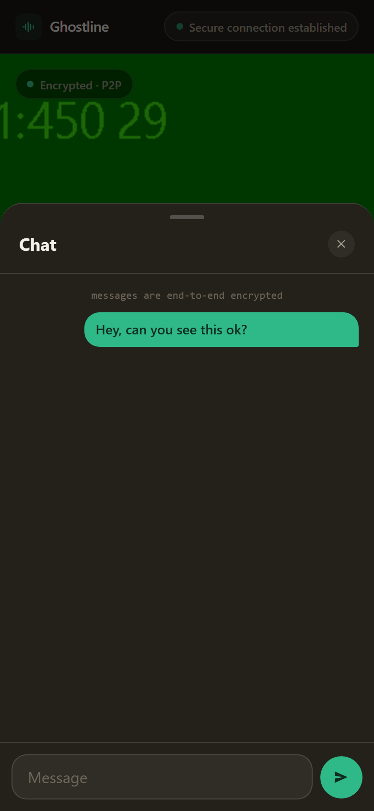
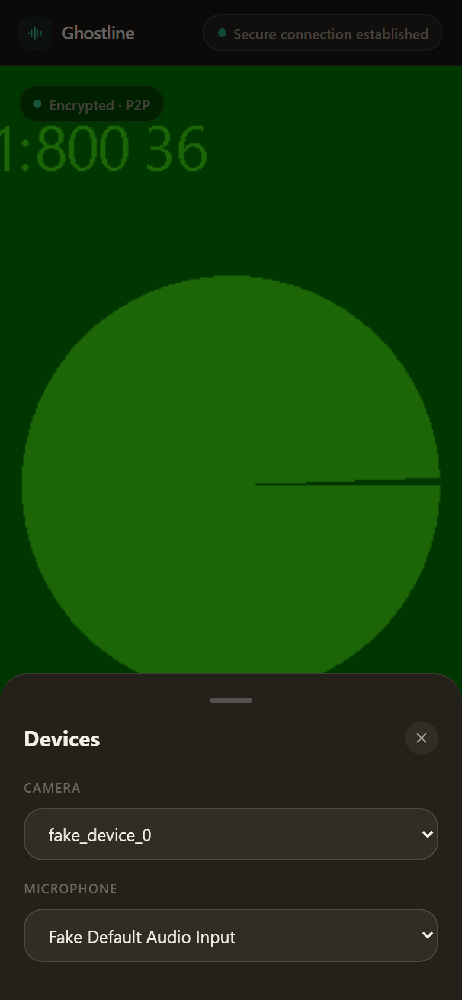

# Ghostline

Zero-log, anonymous, peer-to-peer video chat and file transfer in the browser. No accounts, no database, no message or media storage — the server only exists to help two browsers find each other and exchange WebRTC handshake data.

## Screenshots

<table>
<tr>
<td align="center"><br><sub>Landing</sub></td>
<td align="center"><br><sub>Waiting room (QR + code)</sub></td>
<td align="center"><br><sub>Call + SAS verification</sub></td>
<td align="center"><br><sub>Chat</sub></td>
<td align="center"><br><sub>Camera/mic switcher</sub></td>
</tr>
</table>

<sub>Captured headlessly for documentation, so the video feed shown is Chromium's synthetic test camera, not a real webcam.</sub>

## How it works

1. One person clicks **Create Room** and gets a 6-character room code (and a QR code / shareable link).
2. The other person enters the code, scans the QR code, or opens the link.
3. The server (Socket.io) relays only the WebRTC signaling messages (SDP offer/answer, ICE candidates) needed to establish a direct connection — it never sees audio, video, or file contents.
4. Once connected, video/audio flows peer-to-peer over WebRTC, and files transfer peer-to-peer over a WebRTC data channel, chunked and backpressure-aware. A text chat channel rides the same data channel, so you can always type a message even if the peer connection is still negotiating or media fails.
5. Both sides see a short **SAS (short authentication string)**, derived from each peer's DTLS certificate fingerprint, so they can verbally verify the connection isn't being intercepted.
6. Rooms are in-memory only, capped at 2 occupants, and auto-expire after a period of being idle/single-occupant (`ROOM_TTL_MS`). Nothing is persisted to disk or a database.

## Features

- **P2P video/audio call** via WebRTC (`getUserMedia` + `RTCPeerConnection`)
- **P2P file transfer** over a negotiated WebRTC data channel, chunked (16KB) with backpressure handling for large files
- **Text chat** over the same data channel — a fallback way to communicate that doesn't depend on camera/mic access or media negotiation succeeding
- **Camera/microphone switcher** — pick a different input device mid-call without restarting the call (uses `RTCRtpSender.replaceTrack`, no renegotiation)
- **Room codes + QR codes** for joining, entered via individual OTP-style character boxes (ambiguous characters like `0`/`O`/`1`/`I` excluded from codes)
- **SAS fingerprint verification** to detect signaling-layer MITM, with explicit "It matches" / "Doesn't match" actions — a mismatch ends the call immediately
- **Mic/camera mute toggle** (track-level, no renegotiation)
- **Mobile-friendly** — the call screen fits the visible viewport on phones (no scrolling to see the video), a large touch-sized control bar (56px+ targets), and a responsive layout throughout
- **Auto-expiring rooms** — idle or single-occupant rooms are purged after a TTL
- **Per-socket rate limiting** on room create/join
- **Zero request logging** — no morgan/access logs, no IP-keyed state
- **Strict CSP and security headers**, all static assets (Tailwind, QR library) vendored locally — no third-party script origins
- **Optional self-hosted TURN** (via coturn), with time-limited HMAC credentials, so calls still connect when both peers are on different, restrictive networks (carrier-grade NAT, corporate firewalls)

## Quick start (local)

```bash
npm install
npm start        # or: npm run dev (nodemon)
```

Visit `http://localhost:3000`. Requires Node.js >= 20.

## Quick start (Docker)

```bash
cp .env.example .env   # edit as needed
docker compose up -d
```

To also run a self-hosted TURN relay (coturn) for NAT traversal:

```bash
cp coturn/turnserver.conf.example coturn/turnserver.conf   # edit realm/secret
docker compose --profile turn up -d
```

## Configuration

Set via `.env` (see `.env.example`):

| Variable | Default | Description |
|---|---|---|
| `PORT` | `3000` | Port the server listens on |
| `NODE_ENV` | `production` | Node environment |
| `ALLOWED_ORIGIN` | *(none)* | Exact origin allowed for Socket.io CORS in production |
| `ROOM_TTL_MS` | `600000` | How long an idle/single-occupant room lives before auto-expiring |
| `TURN_URL` | *(none)* | TURN server URL(s), comma-separated; if unset, the app runs STUN-only |
| `TURN_SECRET` | *(none)* | Shared secret for time-limited TURN credentials (coturn `use-auth-secret` mode) — preferred over static credentials |
| `TURN_USERNAME` | *(none)* | Static TURN username — used only if `TURN_SECRET` is unset |
| `TURN_CREDENTIAL` | *(none)* | Static TURN credential — used only if `TURN_SECRET` is unset |

STUN (Google's public STUN servers) is always included as a fallback ICE server, so the app works without any TURN configuration on networks that allow direct/STUN connectivity. TURN becomes necessary when both peers are behind NAT/firewalls restrictive enough that STUN can't find a direct path — this is what makes calls reliably work even when the two devices aren't on the same network.

## Project structure

```
server.js              Express + Socket.io signaling server, room lifecycle, rate limiting
public/
  index.html            App shell
  app.js                Client: signaling, WebRTC, file transfer, chat, device switching, UI state
  vendor/               Vendored, version-pinned third-party assets (Tailwind, QR code)
docs/
  screenshots/          README screenshots
coturn/
  turnserver.conf.example  Sample TURN config for NAT-traversal fallback
Dockerfile              Multi-stage build (deps -> runtime), runs as non-root `node` user
docker-compose.yml       App service + optional `turn` profile for coturn
```

## Security notes

- The signaling server never inspects or stores SDP/ICE payloads beyond confirming the sender belongs to the room; it only relays them.
- Signaling payloads are capped (100KB) to limit abuse — media, file, and chat bytes never touch the server, only peer-to-peer.
- Transport is WebSocket-only (no long-polling fallback) to reduce attack surface and intermediary logging exposure.
- TURN credentials are time-limited (HMAC, derived per session) when `TURN_SECRET` is configured, rather than a long-lived shared password. Static `TURN_USERNAME`/`TURN_CREDENTIAL` are visible to any connecting client via the ICE server payload — fine for trusted/self-hosted use, but prefer `TURN_SECRET` for an internet-facing deployment (see `coturn/turnserver.conf.example`).
